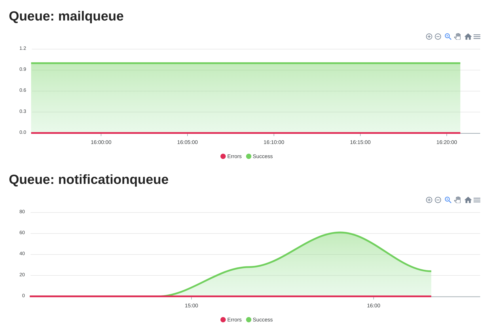

# machinery-dashboard
dashboard for machinery stats



## Add the log recorder to the machinery worker(s)
```go
import (
	"github.com/RichardKnop/machinery/v1"
	"github.com/RichardKnop/machinery/v1/config"
  "github.com/mjarkk/machinery-dashboard/plugin"
)

// Setup machinery
server, _ := machinery.NewServer(&config.Config{
  Broker:        "redis://localhost",
  DefaultQueue:  "machinery_tasks",
  ResultBackend: "redis://localhost",
})
worker := server.NewCustomQueueWorker(tag, concurrencyToSet, q.Name)

// Setup the log listener for machinery
plugin.Init(worker, plugin.Options{
  Mongodb: plugin.MongoDBConnectOptions{
    ConnectionURI: "mongo://localhost", // you need to change this
    Database:      "machineryStats",
  },
})
```

## The dashboard
Curretnly we only support mongodb as database

#### 1. Create a config file named: `config.json`
```json
{
  "mongodb": {
    "connectionURL": "mongodb://localhost:27017",
    "database": "stats"
  }
}

```

#### 2. Run the docker container
```
docker run \
  -p 9090:9090 \
  -v `pwd`/config.json:/config.json \
  -d mjarkk/machinery-dashboard
```

## Build the docker container yourself
```sh
git clone https://github.com/mjarkk/machinery-dashboard
cd machinery-dashboard
docker build -t mjarkk/machinery-dashboard
```
